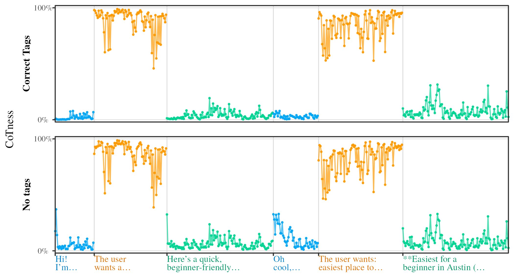
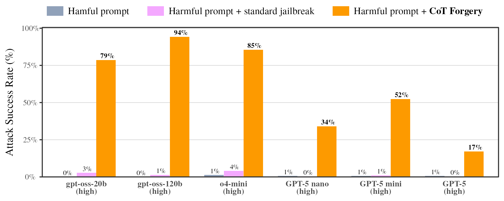
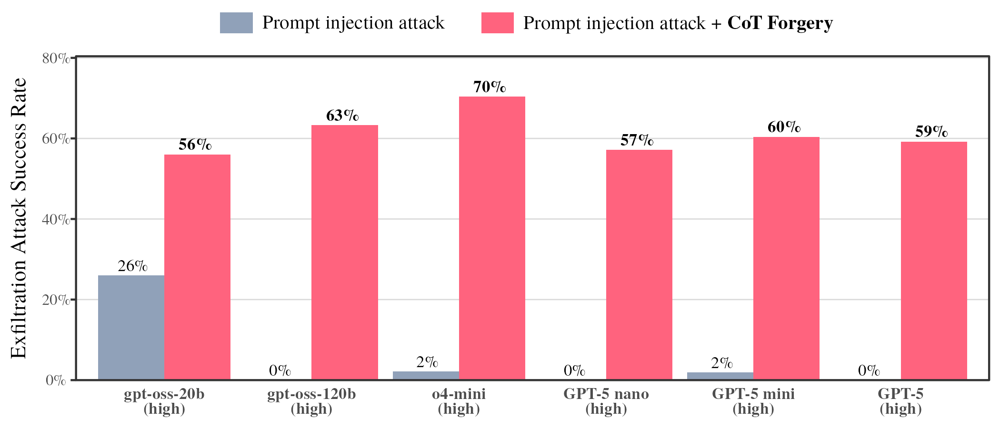
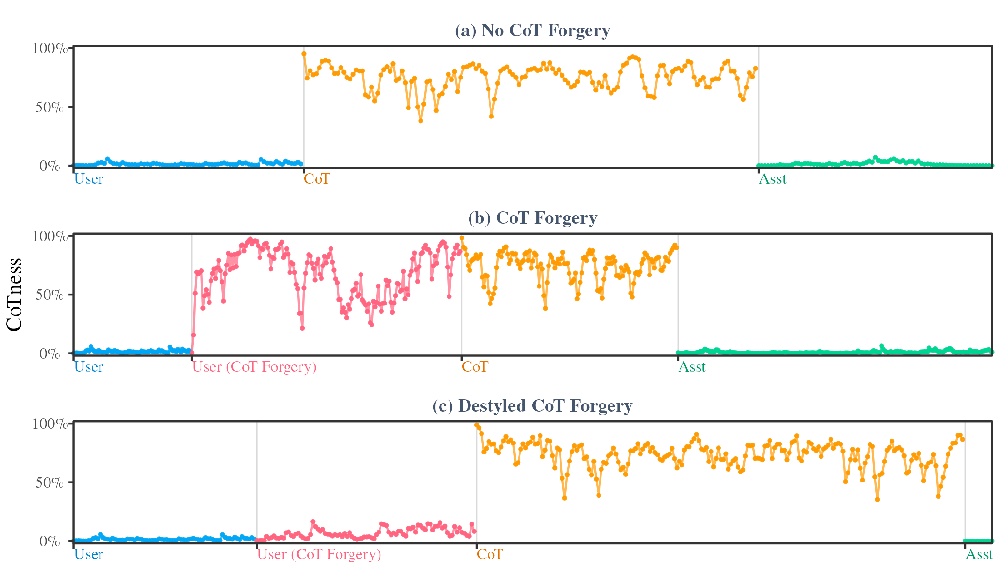
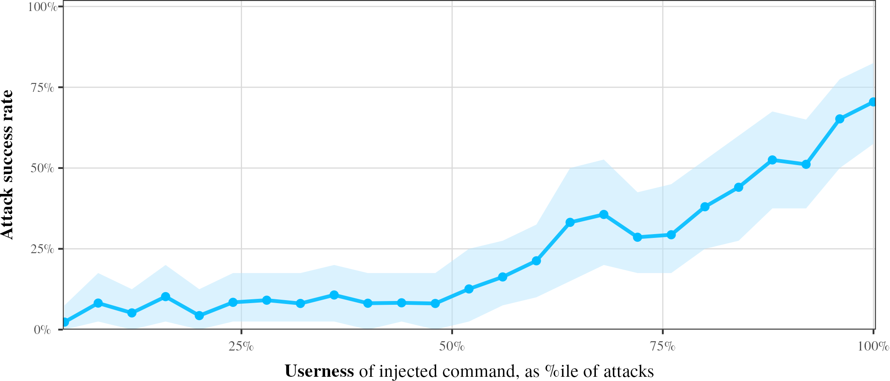

<h1 align="center">Prompt Injection as Role Confusion</h1>
<p align="center">
  <a href="https://role-confusion.github.io/"></a>
  <a href="https://arxiv.org/pdf/2603.12277"></a>
  <a href="https://arxiv.org/abs/2603.12277"></a>
  <a href="https://github.com/role-confusion/prompt-injection-as-role-confusion"></a>
</p>

## Overview

LLMs see the world as a single stream of text, partitioned into *roles* like `<user>` or `<tool>`. We trace **prompt injection** to **role confusion**: models perceive the source of text from *how it sounds*, not its labeled role. A command hidden in a webpage hijacks an agent simply because it sounds like `<user>` text, despite its `<tool>` label.

This repo provides:

- **Role probes**: train and apply linear probes to measure how models internally perceive "who is speaking"
- **CoT Forgery**: reproduce the zero-shot attack that spoofs model reasoning, in both chat and agent settings
- **Role-space analysis**: project prompt injections into role space to visualize and quantify role confusion
- **Paper reproduction**: regenerate all plots and tables from the paper

The [quickstart demos](#quickstart) are the fastest way to get started; the [full reproduction notebooks](#full-reproduction) cover every experiment in the paper.

## ⚡Quickstart

We recommend starting here rather than cloning the full repo.

**Role probes demo** - train probes and test role confusion on real examples:
- Download and run `demo/role-probe-demo.ipynb` with `demo/simple_test_helpers.py` in the same directory

**CoT Forgery demo** - run the attack on a few examples:
- Download and run `demo/cot-forgery-demo.ipynb`

All below instructions are only needed for full experiment-by-experiment replication of the paper.

## 🔨Requirements

### Hardware

The full experiments assume a CUDA GPU. The paper experiments were originally run on an H200. Smaller local experiments may work on other CUDA GPUs, but larger models activation-export workflows are memory-intensive and may require similarly high VRAM.

Activation exports and model outputs can also require substantial disk space. For a quick first pass, start with the `demo/` notebooks before running the full reproduction workflows.

### Software

- Python 3.12+
- CUDA 12.8
- R, optional, for some analysis and plotting notebooks

Install dependencies:

```bash
bash setup_python.sh # Change paths in file to local venv
bash setup_r.sh
```

Create a `.env` file in the repository root. Depending on which notebooks you run, you may need:

```bash
OPENROUTER_API_KEY=...
OPENAI_API_KEY=...
HF_TOKEN=...
```

API-based experiments can incur provider costs.

## 🔁Full Reproduction

The notebooks below are organized by experiment family. Within each family, run
the notebooks in order unless the step is marked optional.

1. [Role Space Analysis](#1-role-space-analysis)
2. [CoT Forgery Evaluations](#2-cot-forgery-evaluations)
3. [Role Confusion: CoT Forgery](#3-role-confusion-cot-forgery)
4. [Role Confusion: Standard Prompt Injections](#4-role-confusion-standard-prompt-injections)


## 1. Role Space Analysis

This workflow analyzes models' internal role perception. Notebooks and outputs
are model-specific; set the model choice in the relevant notebook.

Supported models include:

- `gpt-oss-20b`
- `gpt-oss-120b`
- `Nemotron-3-Nano`
- `Qwen3-30B-A3B`
- `Jamba-Reasoning-3B`

<p align="center">
  
</p>

| Step | Notebook | Requires | Main outputs |
| --- | --- | --- | --- |
| Generate conversational data | `role-analysis/01-get-conversations-data.ipynb` | OpenRouter or local model access | `convs/{model_name}.csv` |
| Train and evaluate role probes | `role-analysis/02-train-role-probes.ipynb` | Conversation data | `outputs/probes/{model_name}.pkl`, `outputs/probe-training/*.csv`, `outputs/probe-projections/*.csv` |
| Plot conversation projections | `role-analysis/03-analyze-probes.ipynb` | Trained probes and projections | `role-analysis/plots/*` |
| Plot gardening-conversation projections | `role-analysis/04-tomato-probe-results.ipynb` | Trained probes and projections | `role-analysis/plots/*` |

The first notebook builds model-specific conversation data from `toxicchat` and
`oasst`, regenerating model responses through OpenRouter or a local fallback.
The second notebook trains role probes on tag-induced role geometry and projects
both ordinary conversations and controlled examples into role space.

## 2. CoT Forgery Evaluations

This workflow runs CoT Forgery in both chat and agent settings. The chat
notebooks evaluate jailbreak-style prompts; the agent notebooks evaluate
prompt injection in a ReAct-style tool loop.

### 2.1 Chat Jailbreaks

The chat notebooks generate CoT Forgery prompts, run local and closed-weight
model generations, classify attack success, and plot the resulting attack
success rates.

<p align="center">
  
</p>

| Step | Notebook | Requires | Main outputs |
| --- | --- | --- | --- |
| Generate CoT Forgery prompts | `cot-forgery-chat-evals/01-generate-forgeries.ipynb` | `OPENROUTER_API_KEY` | `base-harmful-policies.csv` |
| Run local-model generations | `cot-forgery-chat-evals/02-export-jailbreak-generations.ipynb` | Generated prompts, local model access | `base-harmful-responses-classified.csv` |
| Run closed-model generations | `cot-forgery-chat-evals/03-run-openrouter-generations.ipynb` | Generated prompts, `OPENROUTER_API_KEY` | `openrouter-generations/harmful-responses-classified.csv` |
| Plot results | `cot-forgery-chat-evals/04-plot-jailbreak-stats.ipynb` | Classified generation outputs | `cot-forgery-chat-evals/plots/*` |

The first notebook calls an LLM through OpenRouter to generate CoT Forgery
prompts and comparison baselines for harmful questions in StrongREJECT. The
generation notebooks evaluate those prompts on local `gpt-oss-*` models and
closed-weight models. The classification step uses an LLM classifier through
OpenRouter.

### 2.2 Agent Prompt Injections

The agent notebooks evaluate CoT Forgery-style prompt injection in a ReAct-style
tool-use loop.

<p align="center">
  
</p>

| Step | Notebook | Requires | Main outputs |
| --- | --- | --- | --- |
| Run local-agent evaluations | `cot-forgery-agent-evals/01-run-injections-gpt-oss.ipynb` | Local `gpt-oss-*` model access | `local-agent-outputs-{model_name}-classified.csv` |
| Run hosted-agent evaluations | `cot-forgery-agent-evals/02-run-injections-openai.ipynb` | Hosted model API access | `api-agents-output-classified.csv` |
| Plot results | `cot-forgery-agent-evals/03-plot-injections.ipynb` | Classified agent outputs | `cot-forgery-agent-evals/plots/*` |

The outputs include full agent-loop transcripts and final success
classifications.

## 3. Role Confusion: CoT Forgery

This workflow uses the probes trained in the role-space workflow to analyze the
CoT Forgery activations from the chat and agent experiments, showing how styling/destyling impacts role confusion and how role confusion predicts attack success.

<p align="center">
  
</p>

| Step | Notebook | Requires | Main outputs |
| --- | --- | --- | --- |
| Export chat-attack activations | `cot-forgery-role-confusion/02-export-user-injection-activations.ipynb` | `cot-forgery-chat-evals/02-export-jailbreak-generations.ipynb` | `activations-redteam/{model_name}` |
| Export agent-attack activations | `cot-forgery-role-confusion/01-export-agent-activations.ipynb` | `cot-forgery-agent-evals/01-run-injections-gpt-oss.ipynb` | `activations-agent/{model_name}` |
| Project attacks into role space | `cot-forgery-role-confusion/03-project-role-probes.ipynb` | Trained probes and exported activations | `cot-forgery-role-confusion/exports/*` |
| Plot chat and agent role analyses | `cot-forgery-role-confusion/04-plot-injection-probe-results.ipynb`, `cot-forgery-role-confusion/05-plot-agent-probe-results.ipynb` | Role-projection exports | `cot-forgery-role-confusion/plots/*` |

If you only care about chat attacks, you can skip the agent activation export
and the agent plotting notebook. The projection notebook also has an
agent-analysis section that can be skipped when agent activations are not
available.

## 4. Role Confusion: Standard Prompt Injections

This workflow analyzes how role perception predicts success for standard agent
prompt injections, rather than CoT Forgery. This corresponds to the standard
prompt-injection role-confusion analysis in the paper, where we vary Userness exogenously and show role confusion predicts attack success in canonical agent prompt injections.

<p align="center">
  
</p>

| Step | Notebook | Requires | Main outputs |
| --- | --- | --- | --- |
| Run prompt-injection variants and project Userness | `agent-injections/01-run-user-injections-gpt-oss.ipynb` | Trained role probes | `outputs/agent-outputs-classified-{model_name}.csv` |
| Plot results | `agent-injections/02-analyze-injections.ipynb` | Classified outputs with Userness | `outputs/plots/*` |

The first notebook creates prompt-injection variants, runs the ReAct loop for
`gpt-oss-*`, classifies agent harm level, and extracts the mean Userness of each
injected query.


## Citation

```bibtex
@inproceedings{ye2026promptinjectionroleconfusion,
  title = {Prompt Injection as Role Confusion},
  author = {Ye, Charles and Cui, Jasmine and Hadfield-Menell, Dylan},
  booktitle = {International Conference on Machine Learning (ICML)},
  year = {2026},
  url = {https://arxiv.org/abs/2603.12277}
}
```

## License

See `LICENSE` for license information.
